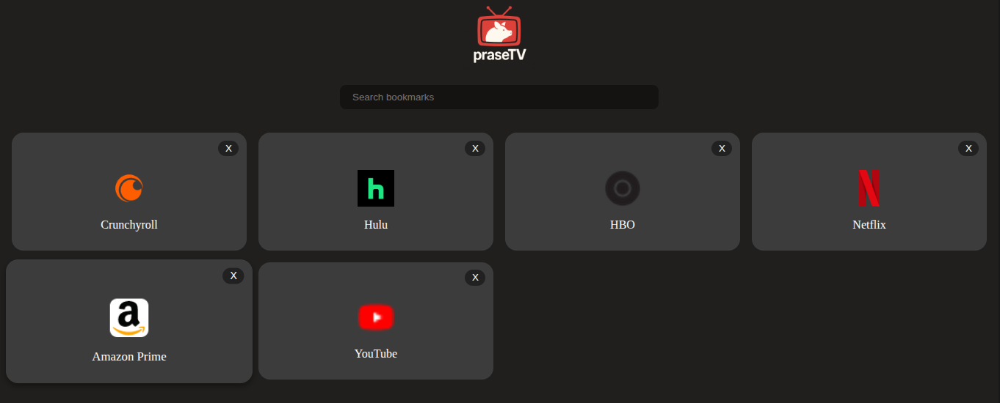

# prase.tv

[](https://www.gnu.org/licenses/gpl-3.0)

**prase.tv** is a self‑hosted, TV‑friendly bookmark manager. It keeps your browser bookmarks in a local SQLite database and provides a simple web UI optimised for the couch. No cloud, no external tracking—everything runs on your machine.

## Stack
- **Backend**: [Go](https://golang.org/) with [Fiber](https://gofiber.io)
- **Frontend**: [Vite.js](https://vitejs.dev/) + TypeScript
- **Browser Extension**: Chrome extension for syncing bookmarks
- **Database**: SQLite
- **Deployment**: Docker / Docker Compose

## Folder structure
- `/server` – Go API server and database schema
- `/web` – Vite web application
- `/extension` – Chrome extension to sync browser bookmarks
- `/nginx` – Nginx config used by Docker

```
praseTV/
├── server      # Go API
├── web         # Frontend
├── extension   # Browser extension
├── nginx       # Reverse proxy config
└── Dockerfile  # Build all components
```

## Local setup 
1. Clone the repo and build the containers:
   ```bash
   git clone https://github.com/AcidBurn/prase.tv.git
   cd prase.tv
   ```

   You can either run 
   ```bash 
   docker compose up --build
   ```

   Or let the run script handle everything for you 
   ```bash 
   chmod +x run_prasetv.sh
   ./run_prasetv.sh
   ```

2. Open `http://prase.tv` in a browser (or localhost if you went without run script). The first run will initialise `prasetv.db` inside the container volume.
3. Install the extension from the `extension/` folder to sync your browser bookmarks.

All data stays local and is served from SQLite. There are no external API calls.

## How it works
- The Dockerfile builds the web UI and Go server into a single image.
- `docker-compose.yml` starts the server and an Nginx proxy on port `80`.
- The Chrome extension sends your bookmarks to `/api/bookmarks/import` and the UI fetches them from `/api/bookmarks`.




## Keyboard controls

The application supports a few keyboard shortcuts for quick navigation. In the
web interface you can move around the bookmark grid using the arrow keys. When
an item is selected:

- **Enter** opens the focused bookmark in a new tab.
- **Delete** removes the bookmark and selects the next one.
- **Arrow Up/Down/Left/Right** switch the focus between bookmarks.
  When no bookmark is focused pressing any arrow key will select the first
  bookmark automatically.

The browser extension also listens for the **Home** key. Pressing it focuses the
open prase.tv tab or opens a new one if none exists.

Navigating the browser tabs? 

Use the browser’s built-in tab navigation:

- `Ctrl + Tab` → Next tab
- `Ctrl + Shift + Tab` → Previous tab
- `Ctrl + W` → Close tab
- `Ctrl + 1` -> You can directly navigate to a tab by giving the tab index (starts from 1)

prase.tv doesn’t override default shortcuts, or tries to mimick their functionality. 

Only `Home` is repurposed (returns to prase.tv inside the extension, and only works outside editable elements, so it doesn't disturb you if you are typing some text).

## Add bookmark 
Once installed, the extension adds an "Add bookmark" option to the right-click (context) menu on any webpage. 

This action uses Chrome's native bookmark API behind the scenes—so anything you bookmark this way automatically syncs with prase.tv.

You can keep using Chrome like you normally would, and prase.tv will stay in sync with your bookmarks seamlessly.

## Bonus: Want to use it as `prase.tv` instead of `localhost`?

You can fake the domain locally using the magic of `/etc/hosts`. On Linux (or macOS), just add this line:

```bash
sudo nano /etc/hosts
```

Then add at the bottom:
```
127.0.0.1    prase.tv
```

(Or you can set up dnsmasq)

Now you can open your browser and visit:\
👉 [**http://prase.tv**](http://prase.tv)

Way fancier than `localhost`, and your couch setup will thank you.\
*Optional: set your browser to auto-launch in kiosk mode for the full TV app experience.*

## Auto-start on boot

If you want prase.tv to run automatically after a reboot, create a systemd service that points to `run_prasetv.sh`. Assuming the repository lives in `/opt/prase.tv`, the service file could look like:

```ini
# /etc/systemd/system/prasetv.service
[Unit]
Description=Start prase.tv at boot
After=network.target docker.service
Requires=docker.service

[Service]
Type=simple
User=yourusername
Group=yourusername
WorkingDirectory=/opt/prase.tv
ExecStart=/opt/prase.tv/run_prasetv.sh
Restart=always
RestartSec=10

[Install]
WantedBy=multi-user.target
```

Enable it with:

```bash
sudo systemctl daemon-reload
sudo systemctl enable --now prasetv.service
```


## Contributing
Pull requests are welcome! See [CONTRIBUTING.md](CONTRIBUTING.md) for details. Whether it’s backend features, new UI ideas or extension tweaks—feel free to jump in.

## License
This project is licensed under the [GNU General Public License v3.0](LICENSE).